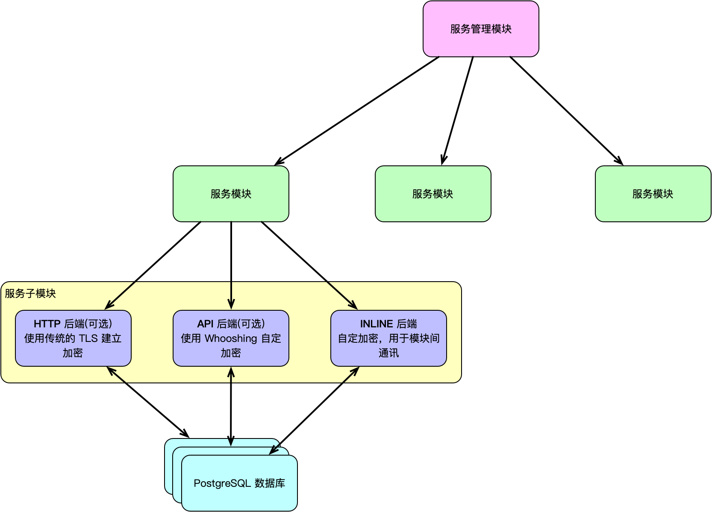

# Whooshing 服务模块依赖库

本项目为 [Whooshing](https://github.com/whooshing-workshop/whooshing) 系统的**服务模块依赖库**，提供了统一的服务启动、配置管理、中间件支持、加密通讯、认证逻辑等基础能力，方便在 API、HTTPS、INLINE 模块间共享通用逻辑与开发规范。

该库以高扩展性为目标，适用于 Vapor + Fluent + PostgreSQL 构建的微服务架构，且支持独立开发调试，部署时支持生产与测试环境的灵活切换。

### 特性

- **环境配置自动解析**：通过 `Environment.Config` 自动加载服务运行环境配置。
- **独立调试支持**：提供 `.independentDebug(...)` 模式，注入调试参数进行独立服务调试。
- **模块间加密通信**：基于 `Cryptos` 模块，提供模块间密钥交换与对称加密通信。
- **通用身份认证**：内置自定义中间件（如 `GuardMiddleware`），结合 INLINE 模块提供统一的用户认证。
- **灵活的微服务启动**：提供 `Whooshing.bootstrap` 与 `Whooshing.make` 高度封装的微服务生命周期管理。

----------

### 服务模块结构



每个服务模块中可以包括以下三个子模块：

#### ✅ API (可选 / 可公开)
- 承担该模块的 Whooshing 公开接口后端，使用 Whooshing 自定加密机制，浏览器不受支持，仅 Whooshing 客户端可访问。
- 提供对外的业务接口服务，支持客户端密钥交换与通信加密。
- 依赖 INLINE 模块完成用户身份认证。

#### 🔐 HTTPS (可选 / 可公开)
- 承担传统的 HTTP 公开后端，使用传统的网络加密，浏览器可访问。
- 以 HTML/JS/CSS 渲染的形式提供服务，适用于需要前端展示的场景。
- 支持中间件注入、静态资源配置等。

#### 🔁 INLINE (必须 / 不公开)
- 承担该模块与 Whooshing 系统交接的后端，自定加密机制，提供模块内部的通讯功能。
- 所有服务模块应向 INLINE 模块注册自身信息，并使用其认证能力。
- 提供加密通道、服务验证等机制。

-------

### 导入该依赖库

在你的 Package.swift 加入：

``` swift
.package(url: "https://github.com/whooshing-workshop/whooshing.toolbox-server.git", from: "1.2.9")
```

并在你所依赖的 target 中添加：

```swift
.product(name: "WhooshingServer", package: "whooshing.toolbox-server")
```

> 要创建完整的服务模块，请优先考虑使用 Whooshing 服务模版，见 [whooshing.template-basic](https://github.com/whooshing-workshop/whooshing.template-basic) 或 [whooshing.template-pgsql](https://github.com/whooshing-workshop/whooshing.template-pgsql)。

--------

### 使用介绍

##### 服务的创建与初始化

Whooshing 服务通过 `Whooshing.Mode` 解析配置，并使用 `Whooshing.bootstrap` 和 `Whooshing.make` 来完成初始化。

```swift
import Vapor
import Logging
import WhooshingServer

// 1. 确定运行模式和配置
// 生产环境可以通过环境变量自动解析，调试环境可传入 DebuggingData
let mode = Whooshing<Inline>.Mode.detect(DebuggingParameters.inlineDebuggingData)

// 2. 引导配置与依赖注册
// 在此处注册需要的驱动，如 [FileStorageDriverKey.self]
let inlineBootstrap = try await Whooshing.bootstrap(
    mode, 
    driverKeys: [], 
    logger: Logger(label: "inline")
).get()

// 3. 生成服务实例
let inline = try await Whooshing.make(inlineBootstrap).get()

// 此时服务实例已构建完成，可以通过 inline.app (Vapor Application) 来进行路由或中间件配置
```

##### 配置路由

构建出服务实例后，可通过 `inline.app`、`api.app` 或 `https.app` 为对应的模块配置路由或控制器。

```swift
func routes<T>(_ woo: Whooshing<T>, _ app: Application) throws where T: ServiceType {
    // 注册基本的请求
    app.get { req async in
        "It works!"
    }

    app.get("hello") { req async -> String in
        "Hello, world!"
    }
    
    // 注册包含多条路由的控制器
    try app.register(collection: UserController())
    try app.register(collection: FileController())
}

// 在服务启动前，将路由注册到你的 app 实例中
try await routes(inline, inline.app)
```

##### 数据库配置与迁移

`Whooshing` 会在配置时提供对数据库（如 PostgreSQL）的支持。如果你需要对数据库进行迁移建表，可在相应的配置逻辑中通过 `app.migrations.add` 注册你的结构，并在所有注册完成后调用 `autoMigrate()`。

```swift
// 为应用注册数据库迁移
// database.id 通常为 "服务名/数据库名" 例如 "default/postgres"
app.migrations.add(User.MIG(), to: database.id)

// 应用所有已注册的迁移
try await app.autoMigrate()
```

##### 启动和挂起服务

在配置完毕所有子服务模块（Inline, API, HTTPS 等）后，可以执行它们并使用 `executeWithAsyncShutdown` 进行阻塞并等待正常关闭：

```swift
// 使用 async let 可以并行运行不同的子服务模块
async let _ = inline.executeWithAsyncShutdown().get()
async let _ = api.executeWithAsyncShutdown().get()
async let _ = https.executeWithAsyncShutdown().get()
```

在测试环境中，你也可以通过 `Entrypoint.runServices` 辅助启动以方便控制：

```swift
try await Entrypoint.runServices(
    shouldStop: {
        // 返回 true 代表应当停止服务
        await TestingShared.testStage == .done
    },
    onReady: {
        // 服务准备就绪时的回调
        print("Server is ready!")
    }
)
```

> **注意**: `Entrypoint` 的 `runServices` 方法通常仅在本地单元测试或者自动化测试脚本中使用，方便对微服务的启停进行精细化控制。

-------

### 运行环境

* **macOS** (> 13.0)
* **iOS** (> 16.0)
* **Linux** (> 20)
* **Swift** (> 6.0)
* **watchOS** (> 6.0) **[未测试]**
* **tvOS**(> 13) **[未测试]**

-------

### 注意事项

- `.independentDebug(...)` 模式仅限于本地测试调试，请勿用于生产环境。
- 使用 `Whooshing.make(...)` 创建服务模块实例时，请确保模块间的依赖顺序正确（如 API 和 HTTPS 必须依赖于 Inline 获取正确的配置和参数）。
- 当前通过服务模版通常只支持 PostgreSQL 作为数据库后端。

如需了解更多，请参阅各模块内的源码注释与文档说明。

------

### 联系与反馈

如有使用问题或建议，请通过 [GitHub Issues](https://github.com/whooshing-workshop/whooshing.toolbox-server/issues) 提交反馈。

或发至邮箱 [contact@official.whooshings.space](mailto:contact@official.whooshings.space)
