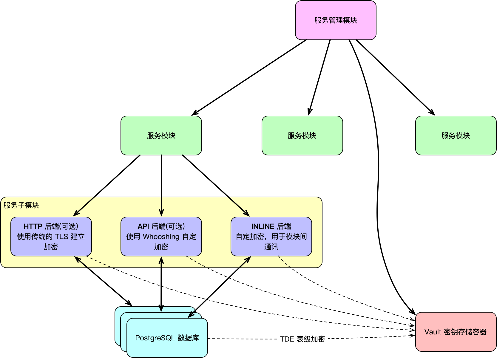

# Whooshing 项目的服务模块依赖库

Whooshing 系统用于创建服务模块的依赖工具库，提供了统一的服务启动、配置管理、中间件支持、加密通讯、认证逻辑等基础能力，方便在 API、HTTPS、INLINE 模块间共享通用逻辑与开发规范。

该库以高扩展性为目标，适用于 Vapor + Fluent + PostgreSQL 构建的微服务架构，且支持独立开发调试，部署时支持生产与测试环境的灵活切换。

-------------

### **服务模块结构**



每个服务模块中包括以下三个子模块：

#### **✅ API**

- 可选
- 可公开
- 承担该模块的 Whooshing 公开接口后端，使用 Whooshing 自定加密机制，浏览器不受支持，仅 Whooshing 客户端可访问。关于 Whooshing 客户端，另见 [whooshing.toolbox-client](https://github.com/SJJC-Team/whooshing.toolbox-client)。
- 提供对外的业务接口服务。
- 支持客户端密钥交换与通信加密。
- 依赖 INLINE 模块完成用户身份认证。

#### **🔐 HTTPS**

- 可选
- 可公开
- 承担传统的 HTTP 公开后端，使用传统的网络加密，浏览器可访问。
- 面向浏览器用户的 HTTPS 服务。
- 以 HTML/JS/CSS 渲染的形式提供服务，适用于需要前端展示的场景。
- 支持中间件注入、静态资源配置等。

#### **🔁 INLINE**

- 必须
- 不公开，模块间使用
- 承担该模块与 Whooshing 系统交接的后端，自定加密机制，提供模块间通讯的功能。
- 提供服务内部模块间的认证、通信和管理。
- 所有服务模块应向 INLINE 模块注册自身信息，并使用其认证能力。
- 提供加密通道、服务验证等机制。

关于 Whooshing 加密，另见 [whooshing-module-manager](https://github.com/SJJC-Team/whooshing-module-manager)

---------

### 导入该依赖库

在你的 Package.swift 加入：

``` swift
.package(url: "https://github.com/SJJC-Team/whooshing.toolbox-server.git", .upToNextMajor(from: "1.0.7"))
```

并在你所依赖的 target 中添加：

```swift
.product(name: "WhooshingServer", package: "whooshing.toolbox-server")
```

> 要创建服务模块，请优先考虑使用 Whooshing 服务模版，见 [whooshing.template-basic](https://github.com/SJJC-Team/whooshing.template-basic)

-----------

### **支持的功能组件**

- 环境配置自动解析 (Environment.Config)
- 独立调试参数注入（independentDebug 模式）
- 密钥交换与对称加密通信（基于 Cryptos 模块）
- 自定义中间件（如 GuardMiddleware）
- 模块间通信接口（如 INLINE 提供的 /user/auth）
- 可扩展的服务启动工厂 Whooshing.make(...)

------

### **注意事项**

- .independentDebug(...) 模式仅限于本地测试调试，请勿用于生产环境。
- 使用 Whooshing.make(...) 创建服务模块实例时，请确保模块间的依赖顺序正确（如 API 必须依赖于 Inline）。
- 当前仅支持 PostgreSQL 作为数据库后端。

如需了解更多，请参阅各模块内的源码注释与文档说明。

---------

### 运行环境

* **macOS** (> 10.15)
* **iOS** (> 13.0)
* **Linux** (> 20)
* **Swift** (> 5.9)
* **watchOS** (> 6.0) **[未测试]**
* **tvOS**(> 13) **[未测试]**
